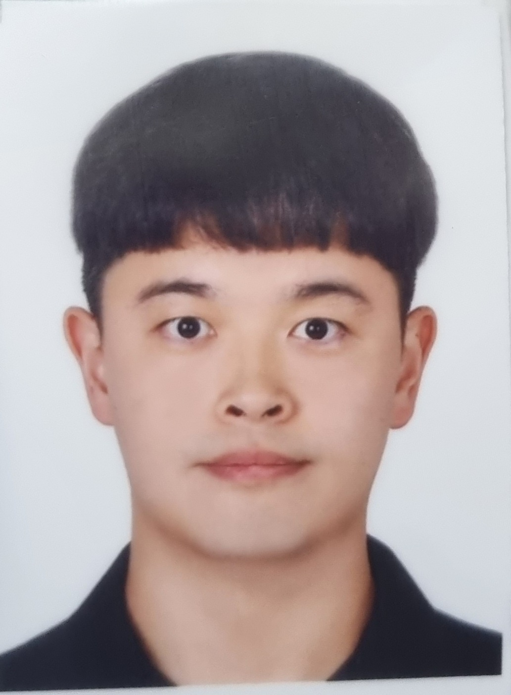

# Jungwoo Kang Profile

{: style="float: left; width: 175px; height: 225px; margin-right: 1em; margin-top: 0.5em  "}

### **Researcher**
I am a Computer Vision Researcher at Pusan National University, Busan.    
I will receive a Master's degree at Pusan National University Computer Vision & Signal Processing Lab[[CVSP]](https://www.pnu-cvsp.com/).      
I was advised by Prof. Kyeongbo Kong.    
My email: dhrn456@gmail.com & dhrn456@naver.com  

[Linkedin](https://www.linkedin.com/in/jungwoo-kang-1b2678218/) \
[Github](https://github.com/rkdwjddn456) \
[Youtube](https://www.youtube.com/channel/UC9jnczmRfukQUH3wOtfYB4A)

 

### Who I am?  
During my M. S degree, I collaborated with LG Electronics H&A team.

### Publications
-

### Project
* LG Electronics, “Development of Nighttime Human Recognition Technology for Home Robot Environments and Enhancement of Daytime Facial Recognition Performance,” (Dec. 2023 – Present)  

### Work Experience
* Robotics & Automation Engineer, POSCO DX, Pohang, Korea (Jul.2022 - Jun.2023)
  
* Sofrware Engineer, DI-Solution, Busan, Korea (Oct.2021 - Apr.2022)
